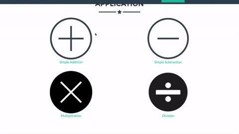
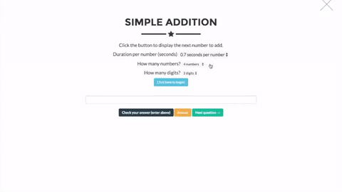

<h1 style="text-align:center">Flashing Abacus Web Application</h1>

Web Application: http://flashingabacus.com

Software Releases: https://github.com/nathan2wong/flashingabacus/releases
 

<h1 style="text-align:center">Usage</h1>

<ol> Go to the application section (http://flashingabacus.com/#portfolio).</ol>
<ol> Select the application that best fits what type of mental arithmetic practice you want to perform. Currently,
Flashing Abacus supports Addition, Subtraction, Multiplication, and Division. In this tutorial, we will use addition
as the application we want to practice with.</ol>
<ol>Within the addition application, specify the how you would like to practice. You can choose from the time
between each number to add, the total amount of numbers to add, and how many digits each number will be.</ol>
<ol>Click the button “Click here to begin​” to start the application.</ol>

<ol> After you have computed the numbers, enter your answer in the space below. Click “Check your Answer​” once
you have finalized your answer. A popup box will notify whether your answer is correct.</ol>
<ol>If you would like to know the correct answer without having to enter an answer, click “Answer”​. A popup box
will notify you of the correct answer.</ol>
<ol> When you have finished the problem, click “Next Question​” to reset the application.</ol>
<ol>You may now continue to the next question. Feel free to change your specifications for the application by
following steps 3-7.</ol>
 

<h2 style="text-align:center">Additional Information</h2>
Video Demo: https://www.youtube.com/watch?v=mDhwXa9LqJ4

Please refer to the <a href="http://flashingabacus.com/instructions.pdf">Instruction Manual</a> for more details on how to use this application.
 
<h1 style="text-align:center">Future Improvements</h1>
Need to implement:
<li>Blinking feature with time. SetTimeout()</li>
<li>More reliable division algorithm</li>
<li>Random digits for addition / subtraction</li>
<li>PHP if more custom formats (ie. color-coded)</li>

If you have any suggestions or improvements you would like to make, feel free to contact me or make a pull request.
